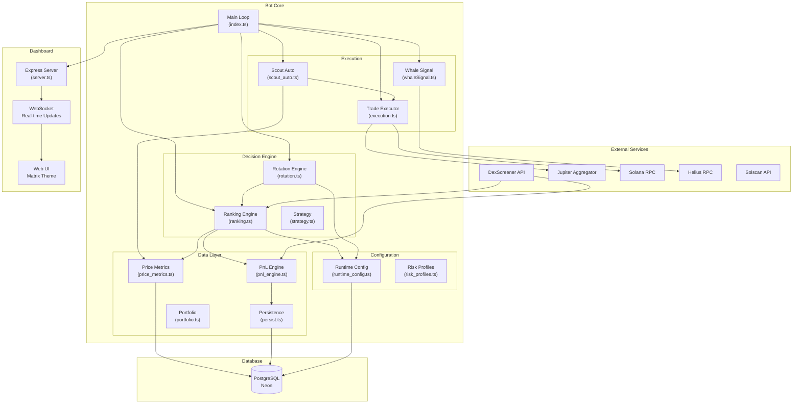
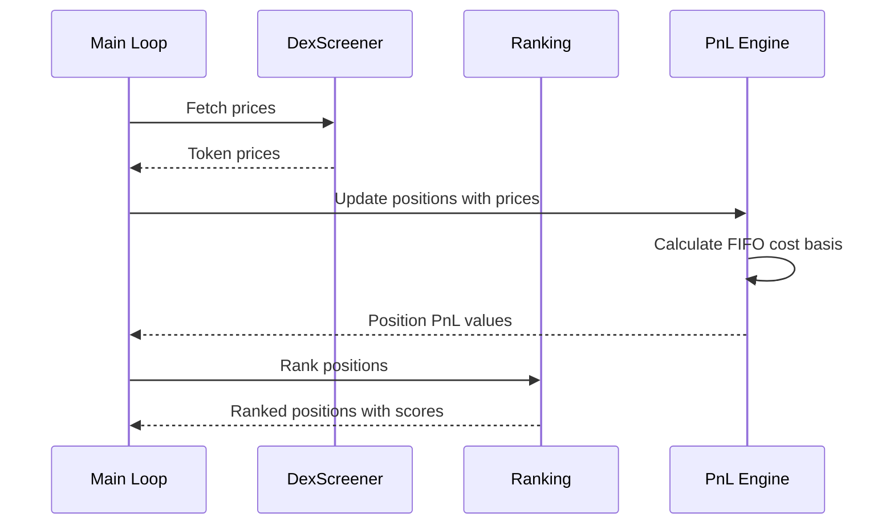
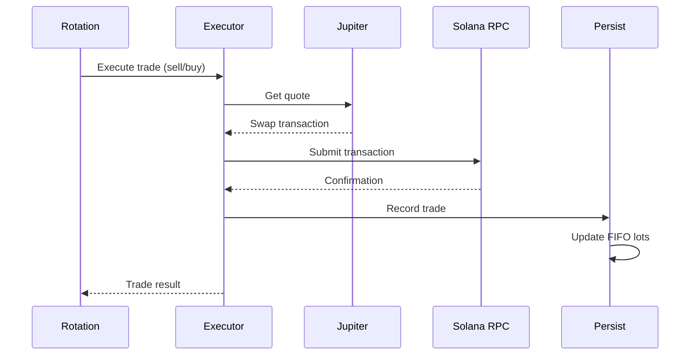
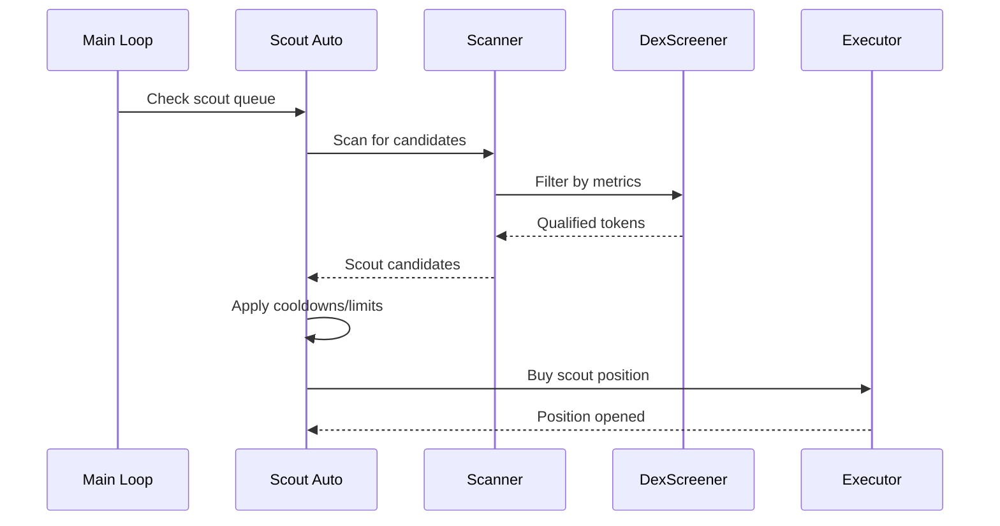

# System Architecture

**Generated:** 2026-01-25
**Git Commit:** 79e1e27

## High-Level Architecture



## Data Flow

### 1. Price Discovery Flow



### 2. Trade Execution Flow



### 3. Scout Discovery Flow



## Component Responsibilities

### Main Loop (index.ts)
- Orchestrates all bot operations on configurable interval (default 60s)
- Manages price fetching, position evaluation, and trade decisions
- Coordinates telemetry and dashboard updates
- Handles graceful shutdown and error recovery

### Ranking Engine (ranking.ts)
- Scores positions using weighted factors:
  - Signal strength (3x weight)
  - Momentum (2x weight)
  - Trailing performance (2.5x weight)
  - Time freshness (1.5x weight)
  - Quality metrics (1x weight)
- Applies penalties for stale positions and trailing stops
- Flags exit conditions (stop loss, underperformance)

### Rotation Engine (rotation.ts)
- Evaluates portfolio for rotation opportunities
- Priority-ordered exit triggers:
  1. Scout stop loss (immediate)
  2. Core loss exit (immediate)
  3. Scout grace expired (timed)
  4. Trailing stops
  5. Stale position exits
  6. Normal rotation
- Manages promotion from scout to core slots

### PnL Engine (pnl_engine.ts)
- FIFO (First-In-First-Out) cost basis tracking
- Per-lot tracking for accurate tax reporting
- Handles decimal corrections from price feeds
- Computes realized and unrealized gains

### Runtime Config (runtime_config.ts)
- 80+ configurable parameters
- Real-time updates without restart
- Validated against schema
- Persisted to database

### Dashboard (server.ts)
- Express HTTP server on port 5000
- WebSocket for real-time updates
- Matrix-themed UI
- API endpoints for manual controls

## Slot Hierarchy

```
┌─────────────────────────────────────────┐
│            CORE SLOTS (5)               │
│  - Higher allocation (12% each target)  │
│  - Promoted from successful scouts      │
│  - Lower exit thresholds                │
└─────────────────────────────────────────┘
                    ▲
                    │ Promotion
                    │ (minPnlPct, minSignalScore, minHoursHeld)
                    │
┌─────────────────────────────────────────┐
│           SCOUT SLOTS (40)              │
│  - Smaller allocation (3% each)         │
│  - Discovery/testing positions          │
│  - Higher stop loss threshold           │
└─────────────────────────────────────────┘
                    ▲
                    │ Entry
                    │ (autonomous discovery, manual queue)
                    │
┌─────────────────────────────────────────┐
│          TOKEN UNIVERSE                 │
│  - Discovered via scanner               │
│  - Filtered by liquidity/volume/holders │
│  - Cooldown management                  │
└─────────────────────────────────────────┘
```
