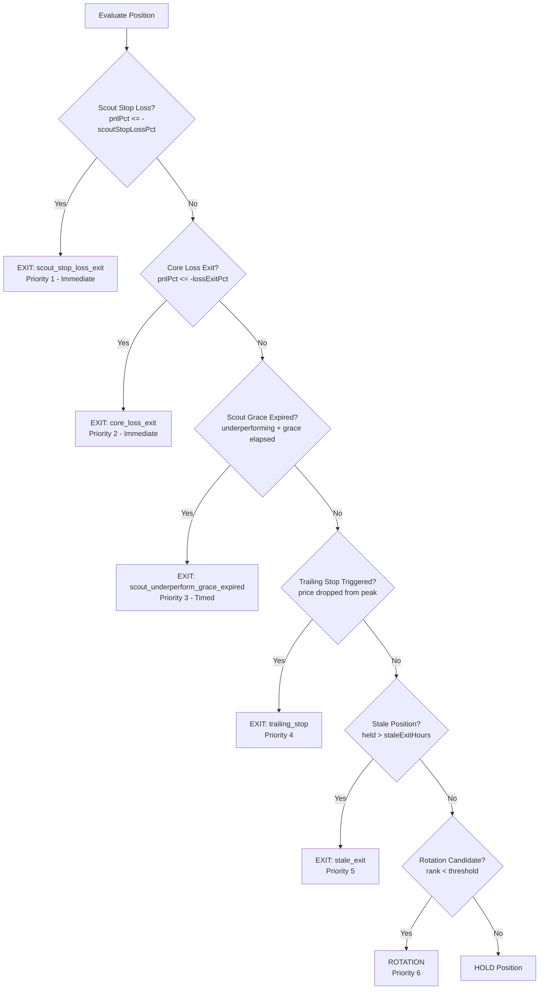
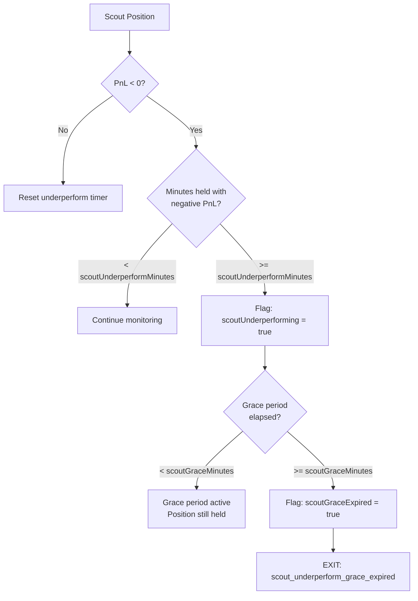
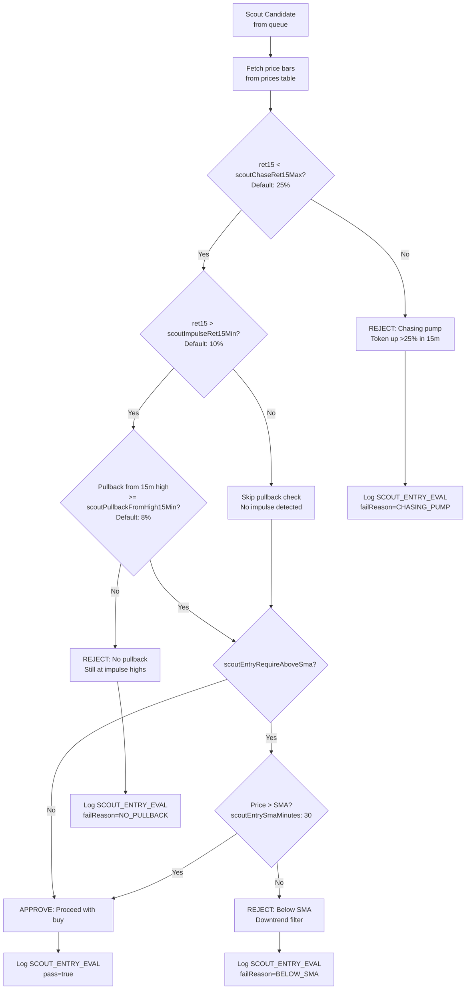
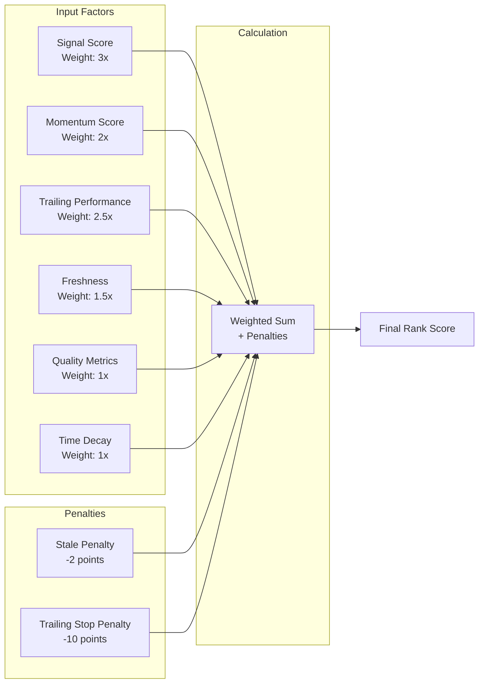
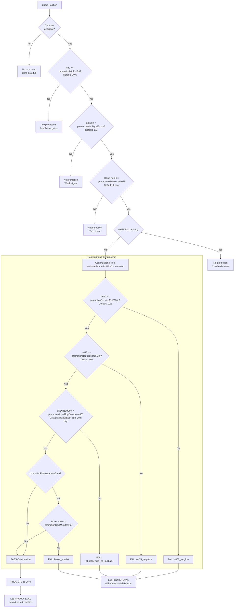
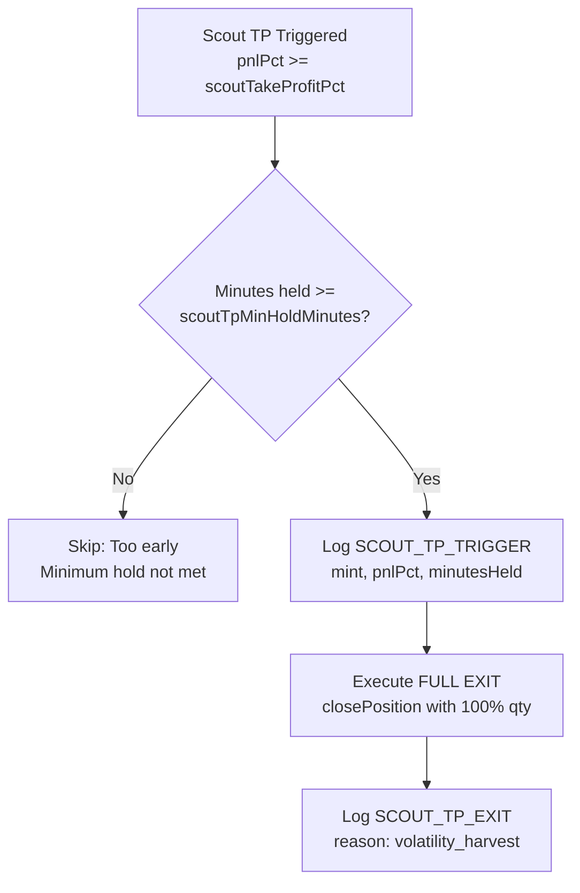
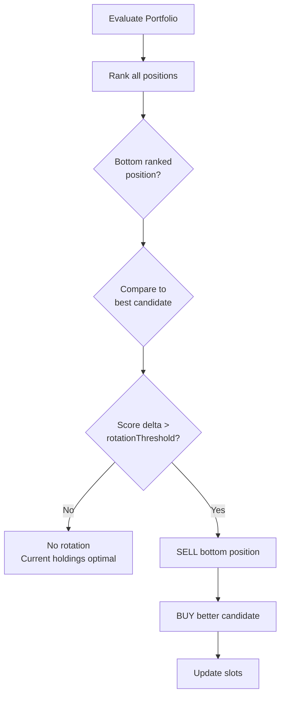
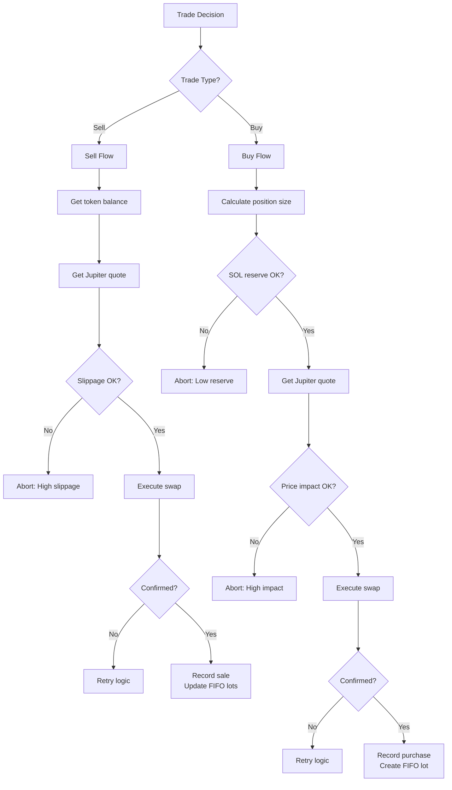
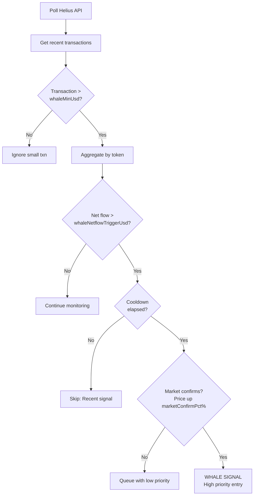

# Decision Flow Diagrams

**Generated:** 2026-01-25
**Git Commit:** 79e1e27

## Exit Decision Priority

The system evaluates positions in a strict priority order. Higher-priority exits are processed first.

## Scout Underperformance Flow

## Scout Entry Gating Flow (Volatility Scraper)

Entry gating prevents chasing pumps and requires pullbacks after impulse moves.

## Position Ranking Score Calculation

## Promotion Decision Flow (Continuation-Only)

Promotions require continuation confirmation via price metrics to avoid buying at tops.
Take-profit always triggers full exit (never promotes) - TP acts as "cash register".

## Scout Take-Profit Flow (Full Exit Only)

## Rotation Decision Flow

## Trade Execution Flow

## Whale Signal Flow

## Configuration Thresholds Reference

| Setting | Default | Description |
|---------|---------|-------------|
| scoutStopLossPct | 0.50 (50%) | Scout immediate exit threshold |
| lossExitPct | 0.15 (15%) | Core forced exit threshold |
| scoutUnderperformMinutes | 30 | Minutes negative before flagging |
| scoutGraceMinutes | 10 | Grace period after flagging |
| stalePnlBandPct | 0.05 (5%) | PnL band for "stuck" detection |
| stalePositionHours | 48 | Hours before stale flag |
| staleExitHours | 72 | Hours before forced stale exit |
| trailingStopBasePct | 0.30 (30%) | Base trailing stop distance |
| trailingStopTightPct | 0.12 (12%) | Tight stop for profitable |
| trailingStopProfitThreshold | 0.50 (50%) | When to tighten stop |
| rotationThreshold | 1.5 | Minimum score delta for rotation |
| promotionMinPnlPct | 0.20 (20%) | Min PnL for promotion |
| promotionMinSignalScore | 1.0 | Min signal for promotion |
| promotionMinHoursHeld | 2 | Min hours for promotion |
| promotionDelayMinutes | 15 | Delay after purchase |
