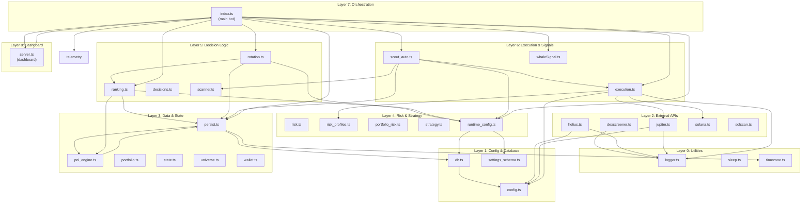
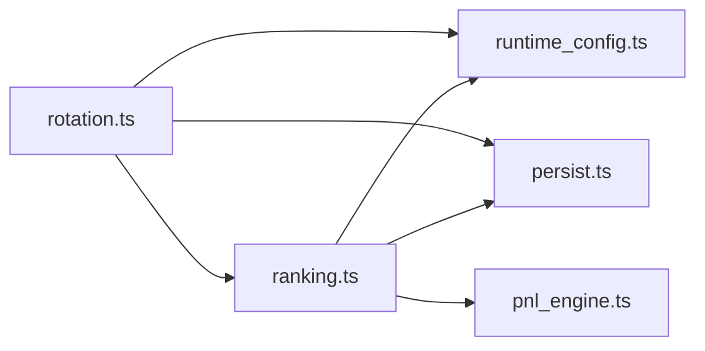
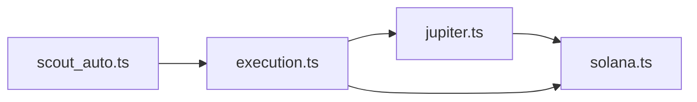
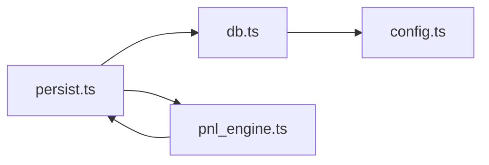

# Dependency Graph

**Generated:** 2026-01-25
**Git Commit:** 79e1e27

## Module Dependency Overview

This document shows which modules import from which other modules, organized by layer.

## Layered Architecture

## Direct Dependencies by Module

### Core Orchestration (index.ts)
Imports from 28 modules - the central hub that coordinates all systems.

| Dependency | Purpose |
|------------|---------|
| rotation.ts | Portfolio rotation decisions |
| ranking.ts | Position ranking and scoring |
| execution.ts | Trade execution |
| persist.ts | Database operations |
| runtime_config.ts | Dynamic configuration |
| scout_auto.ts | Autonomous scouting |
| whaleSignal.ts | Whale tracking signals |
| telemetry.ts | Performance metrics |
| server.ts | Dashboard integration |

### Decision Layer (rotation.ts → ranking.ts)

### Execution Chain

### Data Layer

## Circular Dependencies (Known)

| Cycle | Modules | Status |
|-------|---------|--------|
| 1 | risk_profiles.ts → persist.ts | Controlled - lazy loading |
| 2 | server.ts → index.ts | Intentional bidirectional broadcast |
| 3 | server.ts → index.ts → rotation.ts | Dashboard imports rotation via index |

These circular dependencies are managed through careful import ordering and lazy evaluation where needed.

## Import Count by Module

| Module | Imports From | Imported By |
|--------|--------------|-------------|
| index.ts | 28 | 1 (server.ts) |
| server.ts | 25 | 1 (index.ts) |
| persist.ts | 5 | 12 |
| runtime_config.ts | 3 | 8 |
| execution.ts | 5 | 4 |
| ranking.ts | 4 | 2 |
| rotation.ts | 3 | 2 |
| config.ts | 0 | 8 |
| logger.ts | 0 | 15 |
